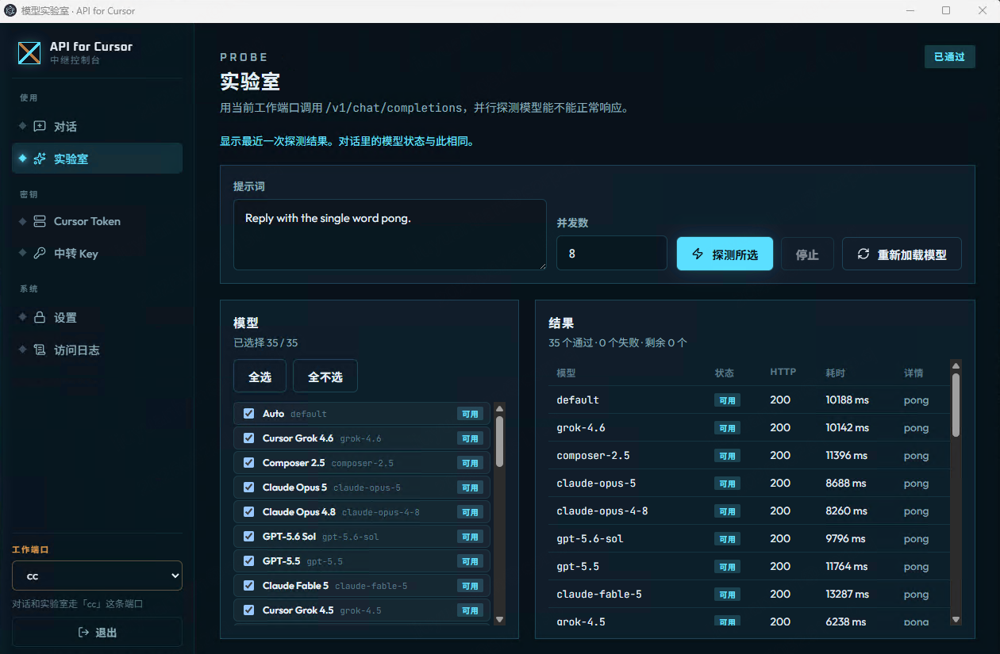

# API for Cursor

Windows 本机的 Cursor 模型中继：提供 OpenAI 兼容的 `/v1` 接口，并带一套中文控制台（对话、实验室探测、密钥与访问日志）。数据写在本机 `%APPDATA%\api-for-cursor\`，不经过原站托管服务。



上图是 **实验室**。选定工作端口后，控制台会并发调用 `/v1/chat/completions`，检查模型是否真正返回内容。截图中 35 个模型全部 HTTP 200，回复为 `pong`。

使用步骤（网页版 / 桌面版、支持的操作系统）见 [操作手册](docs/操作手册.md)。

## 中继控制台

侧栏分组：

| 分组 | 页面 | 作用 |
| --- | --- | --- |
| 使用 | 对话 | 用当前工作端口聊天 |
| 使用 | 实验室 | 并行探测 `/v1/chat/completions`，看延迟和回复 |
| 密钥 | Cursor Token | 保存 Cursor Dashboard 里的 API Key |
| 密钥 | 中转 Key | 发给客户端的 `sk-...` 中继密钥 |
| 系统 | 设置 | 监听地址、控制台密码、SDK 桥 |
| 系统 | 访问日志 | `/v1` 与管理接口的请求记录 |

对话和实验室共用侧栏底部的 **工作端口**（中转 Key）。实验室可改提示词、并发数，对勾选模型执行「探测所选」，结果里有状态、HTTP 码、耗时和正文摘要。

Cursor Token 从 [Cursor Dashboard → Integrations](https://cursor.com/dashboard) 创建，只存在本机，不要提交到 Git。

## 接口

默认基址（与控制台同一端口，未在设置里改过时）：

```txt
http://127.0.0.1:5173/v1
```

- `GET /v1/models`
- `POST /v1/chat/completions`
- `POST /v1/responses`

客户端用中转 Key（`sk-...`）或 Cursor API Key 作为 Bearer。模型 id 以 `/v1/models` 为准，常见包括 `composer-2.5`、`composer-2.5-fast`、`grok-4.6`、`grok-4.5` 以及账号下其它 Cursor 模型。

```ts
import OpenAI from "openai";

const client = new OpenAI({
  apiKey: "sk-你的中转Key",
  baseURL: "http://127.0.0.1:5173/v1"
});

const completion = await client.chat.completions.create({
  model: "composer-2.5",
  messages: [{ role: "user", content: "Write a TypeScript debounce." }]
});
```

```bash
curl http://127.0.0.1:5173/v1/chat/completions \
  -H "Authorization: Bearer sk-你的中转Key" \
  -H "Content-Type: application/json" \
  -d '{"model":"composer-2.5","messages":[{"role":"user","content":"Hello"}]}'
```

支持文本和图片输入、流式/非流式输出。图片可用 Chat Completions 的 `image_url` 或 Responses 的 `input_image`，单张不超过 1MB。

下列 OpenAI 能力此路径不提供，请求会被拒绝：`n > 1`、`logprobs`、音频输出、Responses 上的 OpenAI function/tool、后台 Responses 任务。Token 用量按字符估算；Composer 2.5 与列出的 Grok 模型会按 Cursor 公开单价估算 `usage.cost`。

OpenCode / Codex 等 Agent 把 base URL 指到本机 `/v1` 即可。控制台里也有 Agent 安装入口。

## Windows 安装包

需要 64 位 [Node.js 22](https://nodejs.org/)。

```bat
npm install
npm run dist:win
```

产物在 `dist-win/`：

- `API for Cursor-0.1.1-win.zip`：便携版，解压后运行 `API for Cursor.exe`
- `API for Cursor-0.1.1-setup.exe`：当前用户安装
- `win-unpacked\API for Cursor.exe`：未打包目录，开发机可直接打开

未签名时 SmartScreen 可能拦截，选「仍要运行」。详细说明见 [WINDOWS.md](WINDOWS.md)。

只开开发窗口、不打包：

```bat
npm run desktop
```

## 本地开发

```bat
npm install
npm run db:migrate:local
npm run dev
```

浏览器打开 http://127.0.0.1:5173

`npm run dev` 会同时拉起 Cursor SDK 本地桥（默认 `http://127.0.0.1:8792/sdk`）。监听地址可在 **设置** 里改。单独跑桥：

```bat
npm run sdk:opencode-bridge
```

加密密钥在第一次请求时写入 D1，之后不要轮换。不必准备 `.dev.vars`；若还有旧文件，首次启动会把 `ENCRYPTION_KEY` 导入数据库，然后可以删掉。可选环境变量 `CONSOLE_PASSWORD` 用于第一次给控制台设密码，之后在设置页修改。

访问日志在 **系统 → 访问日志**。调试启动可设 `STATION_DEBUG=1`，或看 `%APPDATA%\api-for-cursor\station.log`。

## 仓库

https://github.com/hexagram-sec/API-For-Cursor
