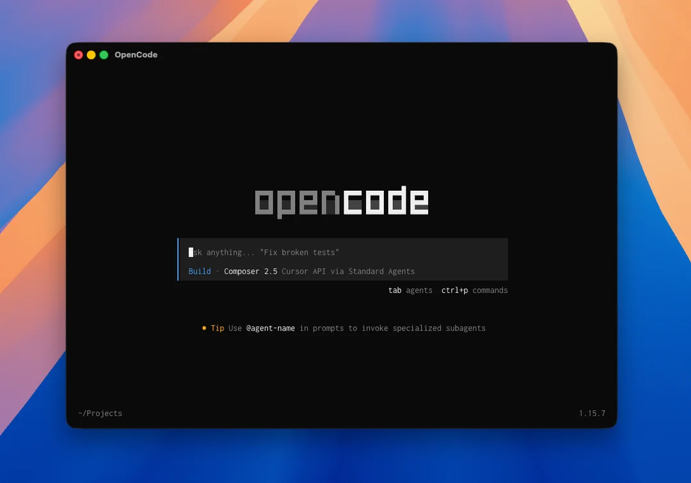

# API for Cursor

Local OpenAI-compatible `chat.completions` and `responses` endpoints backed by Cursor models (Composer 2.5, Grok 4.6, and more).

Download site: https://api-for-cursor.standardagents.ai

## What this is

Cursor does not expose Composer or other first-party models as a raw OpenAI-compatible model endpoint. API for Cursor now ships as a local macOS app that starts a localhost `/v1` server, stores the Cursor API key locally, and configures local agent tools.

The hosted Worker routes remain in the repository for temporary compatibility while the local app rollout is verified. Cursor has asked us to take down the hosted API path, so the production release path is the signed macOS app.

## Supported endpoints

- `POST /v1/chat/completions`
- `POST /v1/responses`
- `GET /v1/models`

## Models

Primary local model ids:

- `composer-2.5`
- `composer-2.5-fast`
- `grok-4.6`
- `grok-4.6-fast`
- `grok-4.5`
- `grok-4.5-fast`

## Usage

Install the macOS app from the DMG and start the local API. The default base URL is:

```txt
http://127.0.0.1:8787/v1
```

Point any OpenAI-compatible client at the local base URL and authenticate with any Bearer token your client requires. The app uses the Cursor API key stored locally in the app UI.

```ts
import OpenAI from "openai";

const client = new OpenAI({
  apiKey: "local",
  baseURL: "http://127.0.0.1:8787/v1"
});

const completion = await client.chat.completions.create({
  model: "composer-2.5",
  messages: [{ role: "user", content: "Write a TypeScript debounce." }]
});
```

```bash
curl http://127.0.0.1:8787/v1/chat/completions \
  -H "Authorization: Bearer local" \
  -H "Content-Type: application/json" \
  -d '{"model":"composer-2.5","messages":[{"role":"user","content":"Hello"}]}'
```

A Cursor user API key comes from the Cursor Dashboard under Integrations. Enter it in the app; do not commit it to source control.

## macOS production release

Release details live in [docs/production.md](docs/production.md).

- Builds are packaged as a signed DMG.
- DMGs are notarized by Apple.
- Sparkle is embedded for auto-updates.

## Legacy hosted-key flow (optional)

The Worker also keeps a backward-compatible hosted-key flow: `POST /api/signup`
verifies a Cursor API key, stores it encrypted in D1, and mints a separate
`cmp_...` proxy key usable against per-account endpoints at
`/u/{account_id}/v1/...`. This flow is optional; the direct Bearer usage above
is the recommended path. A `cmp_...` token is always resolved against D1 and is
never forwarded to Cursor as a Cursor key.

## Compatibility notes

This project supports text and image input, non-streaming and streaming output, JSON-output prompt constraints, and the common SDK response shapes. Image inputs can be sent as Chat Completions `image_url` parts or Responses `input_image` parts; each resolved image must be 1MB or smaller.

These OpenAI features are intentionally rejected because Cursor does not expose equivalent OpenAI controls through this path:

- `n` greater than `1`
- `logprobs` and `top_logprobs`
- audio output
- OpenAI function/tool calls on the Responses API
- background Responses API jobs

Token usage is estimated from character counts because Cursor's stream does not return OpenAI token accounting on this path. For Composer 2.5 and the listed Grok models, `usage.cost` is estimated from Cursor's published per-million-token pricing.

## OpenCode



Use the app's **Agent Setup** pane to install the local OpenCode provider. The configured provider points at the local base URL, not the hosted Worker.

## Local development

```bash
npm install
npm run db:migrate:local
npm run dev
```

Windows 可执行文件：`npm run dist:win`，产物在 `dist-win/`。说明见 [WINDOWS.md](WINDOWS.md)。

Business config (encryption key, SDK listen address, upstream versions) lives in D1.
The encryption key is generated on first request if the database does not already
have one. You do **not** need a `.dev.vars` file for local `npm run dev`.

If you still have an old `.dev.vars`, the first start will import
`ENCRYPTION_KEY` and other values into D1, then ignore the file. After that you
can delete `.dev.vars`. Do not rotate `ENCRYPTION_KEY` once Cursor tokens exist
in the database.

Optional first-run console password can still be set as `CONSOLE_PASSWORD` in the
environment; after the first login the hash is stored in D1 and can be changed
from 设置.

Listen host/port for the SDK bridge and the Vite relay can be changed on the
settings page. Access logs for `/v1` and `/api/admin` are under 访问日志.

The SDK local-agent bridge is started automatically by `npm run dev`. To run it
yourself:

```bash
npm run sdk:opencode-bridge
```

The bridge process also accepts `CURSOR_SDK_BRIDGE_RUN_TIMEOUT_MS`; the default is
`180000`.

Release packages prefer a bundled Node runtime for the local SDK bridge and fall
back to Bun when Node is unavailable.

## Cloudflare

The Worker uses Cloudflare Vite and D1.

Remote migration and deploy commands require a valid `CLOUDFLARE_API_TOKEN` in
the shell environment.

```bash
npm run build
npm run test
npm run typecheck
npm run db:migrate:remote
npm run deploy
```

Optional first-run import (then stored in D1; later ignored):

```bash
wrangler secret put CURSOR_BACKEND_BASE_URL
wrangler secret put CURSOR_CHAT_ENDPOINT
```

`ENCRYPTION_KEY` is generated and stored in D1 on first request if missing. Do
not rotate it after Cursor tokens have been saved. An existing Worker secret is
imported once, then ignored.

Optional: set `CONSOLE_PASSWORD` once to bootstrap the admin console sign-in
gate. The first successful login stores a SHA-256 hash in D1; after that the
Worker uses the database password and you can change it from 设置. Without a
hash in D1 and without this secret the console stays open to anyone who can
reach the host.

The OpenCode SDK harness also requires the `0002_sdk_sessions.sql` migration so
local SDK agent ids can be resumed across Worker isolates.

Local and Windows builds send SDK runs to the Node bridge at
`http://127.0.0.1:8792/sdk` (Vite starts `scripts/cursor-sdk-local-agent-bridge.mjs`).
Change the listen address on the settings page.

Optional SDK harness overrides:

```bash
wrangler secret put CURSOR_SDK_CLIENT_VERSION
wrangler secret put CURSOR_SDK_BRIDGE_URL
wrangler secret put CURSOR_SDK_BRIDGE_TOKEN
```

## Research sources

- Cursor SDK package: `@cursor/sdk@1.0.13`
- Cursor SDK TypeScript docs: https://cursor.com/docs/api/sdk/typescript
- Cursor Composer 2.5 changelog: https://cursor.com/changelog/composer-2-5
- Cursor Grok 4.6 docs: https://cursor.com/docs/models/grok-4-6
- Cursor Grok 4.5 docs: https://cursor.com/docs/models/grok-4-5
- OpenAI Chat Completions reference: https://developers.openai.com/api/docs/api-reference/chat
- OpenAI Responses reference: https://developers.openai.com/api/docs/api-reference/responses
- OpenAI migration guide: https://developers.openai.com/api/docs/guides/migrate-to-responses
